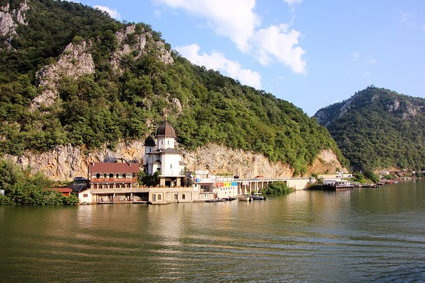
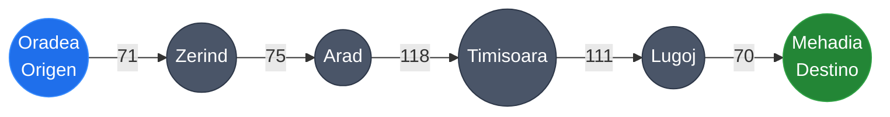
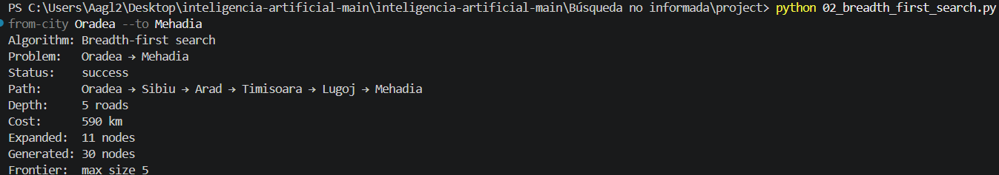
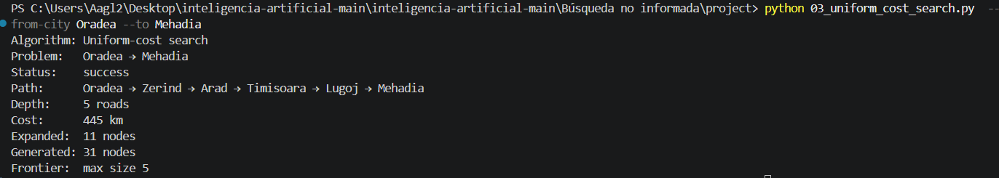
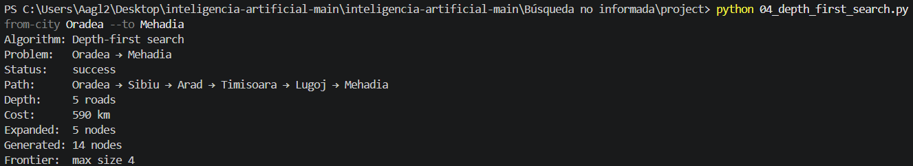
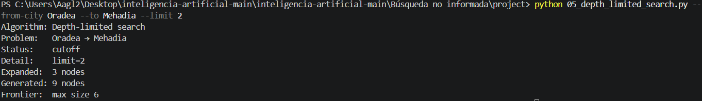
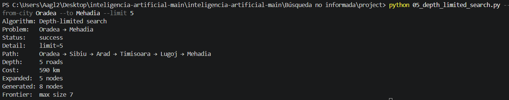
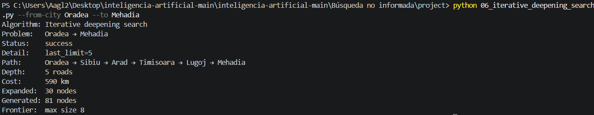

# Ejercicio 1 - Búsqueda no Informada

**Autor:** Ángel Alberto González Lugo  

---

## Sección I. Ciudades y Grafo

### Oradea
Es una ciudad ubicada en la región noroeste de Rumanía, cerca de la frontera con Hungría. En el mapa del problema de búsqueda no informada de IA, funciona como un punto de entrada estratégico en el extremo superior oeste de la red de carreteras, conectando directamente con nodos como **Zerind** (71 km) y **Sibiu** (151 km).

---

### Mehadia
Es una localidad situada en el suroeste de Rumanía, dentro de la región histórica del Bánato. En el grafo de carreteras, se posiciona en el corredor suroeste que bordea la frontera, sirviendo como enlace directo entre **Lugoj** (70 km) y **Drobeta** (75 km).

---

### Subgrafo: Ruta de Oradea a Mehadia

El recorrido directo entre **Oradea** (Origen) y **Mehadia** (Destino) a través del borde occidental del mapa abarca exactamente **4 paradas intermedias** (`Zerind`, `Arad`, `Timisoara`, `Lugoj`), acumulando un total de 5 pasos o aristas con una distancia total de 445 km.

## Sección II. Resultados y Análisis de Algoritmos

A continuación se presenta la tabla comparativa con los resultados obtenidos al ejecutar los algoritmos de búsqueda no informada para el problema **Oradea → Mehadia**:

| Algoritmo | Status | Path | Depth | Cost | Expanded |
| :--- | :--- | :--- | :--- | :--- | :--- |
| **Breadth-First Search (BFS)** | success | Oradea → Sibiu → Arad → Timisoara → Lugoj → Mehadia | 5 roads | 590 km | 11 nodes |
| **Uniform-Cost Search (UCS)** | success | Oradea → Zerind → Arad → Timisoara → Lugoj → Mehadia | 5 roads | 445 km | 11 nodes |
| **Depth-First Search (DFS)** | success | Oradea → Sibiu → Arad → Timisoara → Lugoj → Mehadia | 5 roads | 590 km | 5 nodes |
| **Depth-Limited Search (DLS, limit=2)** | cutoff | N/A | N/A | N/A | 3 nodes |
| **Depth-Limited Search (DLS, limit=5)** | success | Oradea → Sibiu → Arad → Timisoara → Lugoj → Mehadia | 5 roads | 590 km | 5 nodes |
| **Iterative Deepening Search (IDS)** | success | Oradea → Sibiu → Arad → Timisoara → Lugoj → Mehadia | 5 roads | 590 km | 30 nodes |

## Sección III. Reporte de Resultados y Análisis

En este experimento, **BFS** y **UCS** coinciden en encontrar rutas de 5 carreteras para llegar de Oradea a Mehadia, pero difieren notablemente en la calidad de la solución en términos de distancia. Al explorar nivel por nivel sin considerar los pesos de las aristas, BFS devuelve el primer camino que alcanza la meta en número de pasos, seleccionando la vía por Sibiu con un costo total de **590 km**. En cambio, UCS administra su frontera mediante una cola de prioridad basada en el costo acumulado $g(n)$, lo que le permite priorizar los caminos geográficamente más cortos e identificar la ruta óptima a través de Zerind, Arad, Timisoara y Lugoj, logrando el menor kilometraje posible (**445 km**).

Por otro lado, **DFS** también devuelve la ruta larga de 590 km a pesar de trabajar sobre el mismo grafo. Este comportamiento se debe a la estructura de pila LIFO que utiliza, la cual fuerza al algoritmo a profundizar exhaustivamente por la primera rama expandida —en este caso, la conexión hacia Sibiu—. Como DFS carece de un mecanismo para evaluar el costo de las carreteras y no garantiza una ruta lo más optima posible, simplemente retorna la primera solución completa que encuentra al fondo de la rama, ignorando la existencia de alternativas más cortas en kilometraje.

En cuanto al límite de profundidad, **DLS** marca un corte cuando se ejecuta con `--limit 2` porque la búsqueda se topa con una pared al llegar a Arad (a través de Sibiu), quedándose aun a 3 pasos de la meta. Por lo cual, fue necesario subir el límite a 5 para poder obtener un resultado exitoso. Esto se entiende mejor al compararlo con los otros dos algoritmos: BFS avanza por niveles y deja en claro desde el inicio que el objetivo está exactamente en el nivel 5. IDS, por su parte, lo que hace tras bambalinas es correr DLS en bucle ($l=0, 1, 2, 3, 4, 5$), rebotando en cada intento hasta que por fin el límite empareja con la profundidad real de Mehadia. Al final, todo se reduce a que $d = 5$ es el recorrido mínimo para este mapa, fijando la barra exacta que DLS e IDS deben superar para funcionar.

## Sección IV. Evidencias de Ejecución

### 1. Búsqueda en Ancho (BFS)

---

### 2. Búsqueda de Costo Uniforme (UCS)

---

### 3. Búsqueda en Profundidad (DFS)

---

### 4. Búsqueda de Profundidad Limitada (DLS)
#### Límite 2 (Cutoff)

#### Límite 5 (Success)

---

### 5. Búsqueda de Profundidad Iterativa (IDS)
