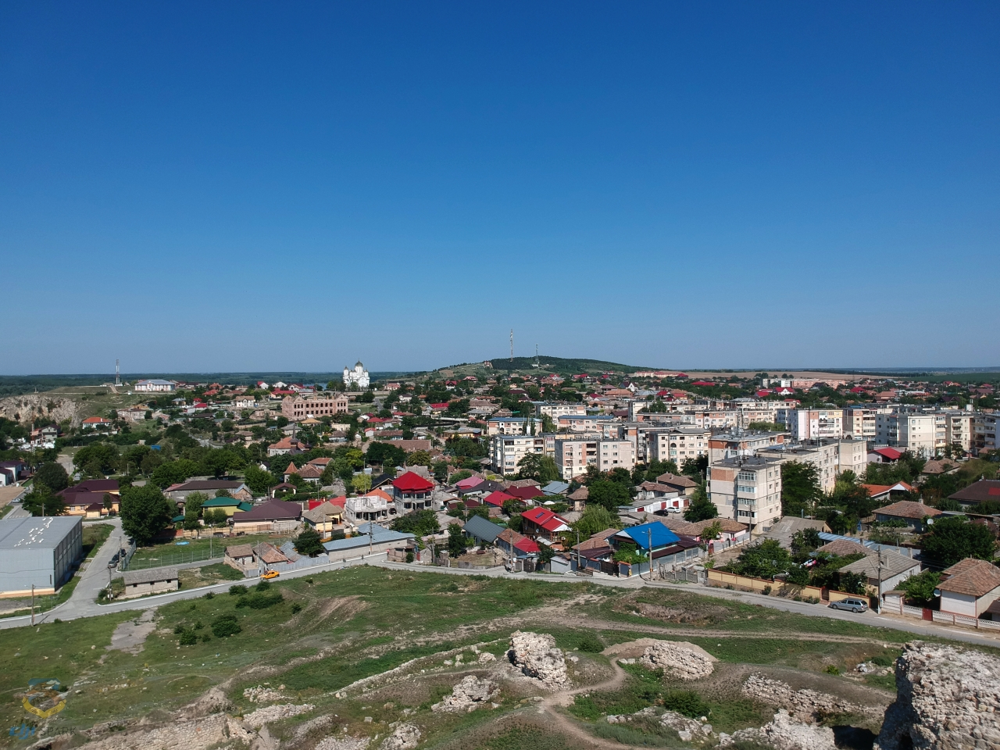
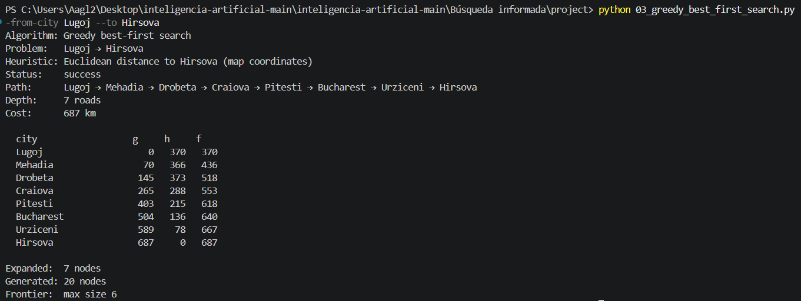
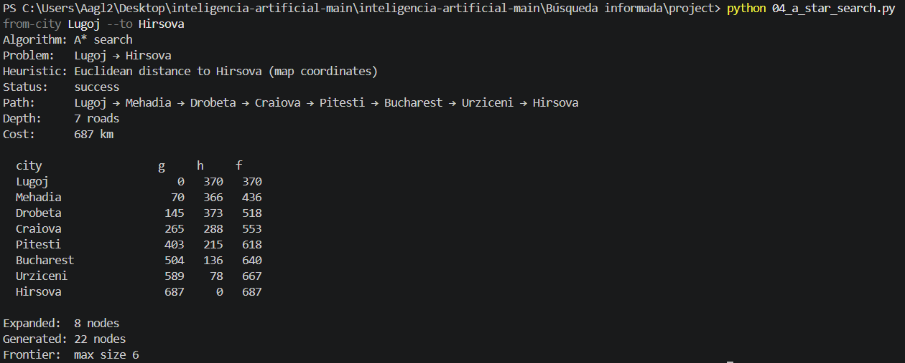

# Ejercicio 1 - Búsqueda Informada

**Autor:** Ángel Alberto González Lugo  

---

## Sección I. Ciudades y Grafo

### Lugoj
Es una ciudad ubicada en el oeste de Rumanía, en el distrito de Timiș (región histórica del Bánato). En el grafo del problema del mapa de Rumanía, actúa como un punto de conexión clave en la ruta del suroeste, enlazando directamente con **Timisoara** (111 km) al noroeste y con **Mehadia** (70 km) al sureste.

---

### Hirsova
Es una ciudad situada en el SE de Rumanía, en el distrito de Constanța, a orillas del río Danubio (región de Dobrogea). En la red de carreteras del mapa, se posiciona en la sección oriental, conectando hacia el oeste con **Urziceni** (98 km) y hacia el sur con **Eforie** (86 km).

---

### Ruta de Lugoj a Hirsova

Ruta óptima entre **Lugoj** (Origen) y **Hirsova** (Destino). Cada nodo muestra el nombre de la ciudad junto a su valor de heurística $h(n)$ (distancia en línea recta a Hirsova), y cada arista indica la distancia real en kilómetros entre conexiones:

```mermaid
graph LR
    Lugoj(("Lugoj\n(h=370)\n[Origen]"))

    Lugoj -->|111| Timisoara(("Timisoara\n(h=444)"))
    Timisoara -->|118| Arad(("Arad\n(h=465)"))
    Arad -->|75| Zerind(("Zerind\n(h=463)"))
    Zerind -->|71| Oradea(("Oradea\n(h=460)"))
    Oradea -->|151| Sibiu(("Sibiu\n(h=344)"))
    Sibiu -->|99| Fagaras(("Fagaras\n(h=249)"))
    Fagaras -->|211| Bucharest(("Bucharest\n(h=136)"))

    Lugoj -->|70| Mehadia(("Mehadia\n(h=366)"))
    Mehadia -->|75| Drobeta(("Drobeta\n(h=373)"))
    Drobeta -->|120| Craiova(("Craiova\n(h=288)"))
    Craiova -->|138| Pitesti(("Pitesti\n(h=215)"))
    Pitesti -->|101| Bucharest

    Bucharest -->|85| Urziceni(("Urziceni\n(h=78)"))
    Urziceni -->|98| Hirsova(("Hirsova\n(h=0)\n[Destino]"))

    style Lugoj fill:#1f6feb,stroke:#388bfd,color:#fff
    style Hirsova fill:#238636,stroke:#2ea043,color:#fff
    style Timisoara fill:#30363d,stroke:#8b949e,color:#c9d1d9
    style Arad fill:#30363d,stroke:#8b949e,color:#c9d1d9
    style Zerind fill:#30363d,stroke:#8b949e,color:#c9d1d9
    style Oradea fill:#30363d,stroke:#8b949e,color:#c9d1d9
    style Sibiu fill:#30363d,stroke:#8b949e,color:#c9d1d9
    style Fagaras fill:#30363d,stroke:#8b949e,color:#c9d1d9
    style Mehadia fill:#4a5568,stroke:#2d3748,color:#fff
    style Drobeta fill:#4a5568,stroke:#2d3748,color:#fff
    style Craiova fill:#4a5568,stroke:#2d3748,color:#fff
    style Pitesti fill:#4a5568,stroke:#2d3748,color:#fff
    style Bucharest fill:#4a5568,stroke:#2d3748,color:#fff
    style Urziceni fill:#4a5568,stroke:#2d3748,color:#fff
```

## Sección II. Resultados y Análisis de Algoritmos

A continuación se presenta la tabla comparativa con los resultados obtenidos al ejecutar los algoritmos de búsqueda informada para el problema **Lugoj → Hirsova**:

| Algoritmo | Estado | Heurística | Ruta (*Path*) | Profundidad | Costo | Nodos Expandidos |
| :--- | :--- | :--- | :--- | :--- | :--- | :--- |
| **Greedy Best-First Search** | Éxito | Distancia euclidiana a Hirsova (coordenadas del mapa) | Lugoj → Mehadia → Drobeta → Craiova → Pitesti → Bucharest → Urziceni → Hirsova | 7 carreteras | 687 km | 7 nodos |
| **A* Search** | Éxito | Distancia euclidiana a Hirsova (coordenadas del mapa) | Lugoj → Mehadia → Drobeta → Craiova → Pitesti → Bucharest → Urziceni → Hirsova | 7 carreteras | 687 km | 8 nodos |

## Sección III. Reporte de Resultados y Análisis

Durante la ejecución de las pruebas, **A\*** logró identificar con éxito el trayecto más corto en distancia real entre Lugoj y Hirsova, sumando un total de **687 km** a lo largo de 7 tramos de carretera. Al basar su estimación en la distancia en línea recta (una heurística claramente admisible al no sobreestimar jamás la trayectoria real), el algoritmo asegura una ruta óptima. Esto lo consigue equilibrando en todo momento el tramo que ya se ha recorrido (*g(n)*) con la distancia que proyecta hacia el destino (*h(n)*) a través de su función de evaluación *f(n) = g(n) + h(n)*.

En este caso particular, **Greedy Best-First Search** llegó exactamente al mismo resultado de 687 km, sin mostrar desviaciones con respecto a la ruta de A\*. No obstante, el hecho de que hayan coincidido en esta red de caminos no implica que Greedy ofrezca siempre la solución más barata. Incluso trabajando con una heurística admisible, Greedy puede terminar seleccionando una ruta más costosa debido a que guía sus decisiones tomando únicamente *f(n) = h(n)*. Como no guarda un registro de la distancia acumulada en el camino (*g(n)*), actúa con una visión un tanto miope: en cada intersección simplemente escoge a la ciudad vecina que aparente estar más próxima a la meta en el mapa, pasando por alto si el trayecto para llegar hasta ella implicó un desvío o un costo desproporcionado.

Por último, al observar el avance de A\* a lo largo del trayecto, se aprecia que el valor de la función de evaluación $f(n)$ es **monótonamente no decreciente**; es decir, la suma estimada se mantiene constante o va en aumento a medida que nos adentramos en los nodos de la ruta. Este comportamiento es una consecuencia directa de contar con una heurística **consistente**, la cual respeta la regla del triángulo: $h(n) \le c(n, a, n') + h(n')$. Al utilizar la tabla de distancias directas de AIMA hacia un destino como Hirsova, el valor de la heurística nunca cae de golpe tan rápido como para superar el costo real del tramo que se acaba de avanzar ($c(n, a, n')$). Esto permite que A\* vaya explorando la frontera de ciudades en capas progresivas de costo ascendente, evitando que deba reevaluar trayectos recorridos previamente y asegurando la ruta óptima a la primera.

## Sección IV. Evidencias y Tabla de Heurística

### 1. Evidencias de Ejecución de Algoritmos

A continuación se adjuntan las capturas de pantalla que respaldan la ejecución y validación de los algoritmos de búsqueda para el trayecto **Lugoj → Hirsova**:

#### Greedy Best-First Search
Muestra del árbol/secuencia de expansión y la ruta final generada mediante la función de evaluación $f(n) = h(n)$:

#### A* Search
Muestra del árbol/secuencia de expansión, costos acumulados $g(n)$ y ruta óptima generada mediante la función de evaluación $f(n) = g(n) + h(n)$:

---

### 2. Tabla de Heurística ($h(n)$ en línea recta hacia Hirsova)

Valores de la distancia euclidiana estimados desde cada ciudad del mapa hacia el destino final (**Hirsova**). Estos valores actúan como la función $h(n)$ utilizada por ambos algoritmos durante la búsqueda:

| Ciudad ($n$) | Distancia Euclidiana a la Meta $h(n)$ [km] | Notas / Relación con el Origen |
| :--- | :---: | :--- |
| **Hirsova** | **0** | **Objetivo (Goal)** |
| Eforie | 64 | Vecino de Hirsova |
| Urziceni | 78 | Conexión directa a Hirsova |
| Vaslui | 97 | Región Este |
| Bucharest | 136 | Conexión a Urziceni |
| Iasi | 168 | Región Noreste |
| Giurgiu | 178 | Región Sur |
| Pitesti | 215 | Conexión a Bucharest |
| Neamt | 227 | Región Norte |
| Fagaras | 249 | Región Central |
| Craiova | 288 | Conexión a Pitesti |
| Rimnicu Vilcea | 307 | Región Central |
| Sibiu | 344 | Región Central |
| Mehadia | 366 | Vecino de origen (a 70 km de Lugoj) |
| **Lugoj** | **370** | **Punto de inicio (Start)** |
| Drobeta | 373 | Conexión a Mehadia |
| Timisoara | 444 | Vecino de origen (a 111 km de Lugoj) |
| Oradea | 460 | Región Noroeste |
| Zerind | 463 | Región Noroeste |
| Arad | 465 | Región Oeste |