# Ejercicio 1 - Perceptrón Multicapa

**Autor:** Ángel Alberto González Lugo

---

## Sección 1: Links a los notebooks en Colab

- **Notebook 01 — Perceptrón Multicapa:** [https://colab.research.google.com/drive/1OXQbKwQ_IqAozxuhp8AZtjdaXkaxzob_#scrollTo=mElCs_8gHx51](https://colab.research.google.com/drive/1OXQbKwQ_IqAozxuhp8AZtjdaXkaxzob_#scrollTo=mElCs_8gHx51)
- **Notebook 02 — Perceptrón con Keras:** [https://colab.research.google.com/drive/1bS2CYDsuc9_UQnsqbBGt-HHkuV2KEq_B#scrollTo=jBB0P5VFDD79](https://colab.research.google.com/drive/1bS2CYDsuc9_UQnsqbBGt-HHkuV2KEq_B#scrollTo=jBB0P5VFDD79)

---

## Sección 2: Tablas comparativas

### Perceptrón Multicapa (NumPy)

| Arquitectura | No. de corrida | Topología | Error final (Época 500) |
|---|---|---|---|
| Perceptrón Multicapa (NumPy) | Corrida 1 | 4 x 3 x 3 | 0.09684023230746501 |
| Perceptrón Multicapa (NumPy) | Corrida 2 (profunda) | 4 x 3 x 3 x 3 x 3 | 0.6689697575495134 |

#### Curva original
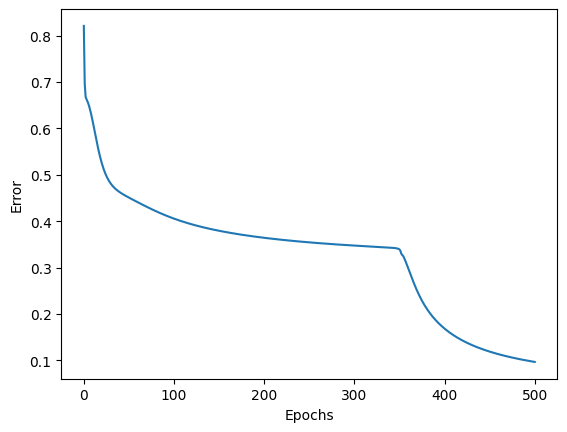

#### Curva profunda
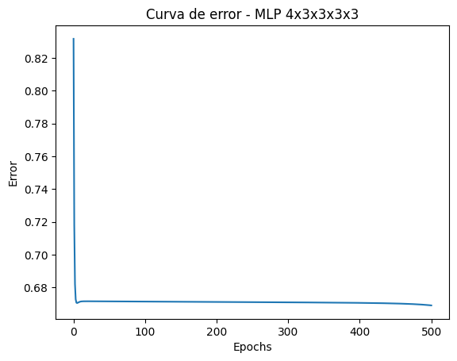

---

### Perceptrón con Keras

| Arquitectura | No. de corrida | Topología | Loss final | Predicción de ejemplo `[3,3,1,1]` |
|---|---|---|---|---|
| Keras | Corrida 1 | 4 x 3 x 3 | 0.1317 | [0.6700751, 0.27656996, 0.20417917] |
| Keras | Corrida 2 (profunda) | 4 x 3 x 3 x 3 x 3 | 0.2223 | [0.33490622, 0.33555606, 0.33574948] |

#### Modelo original
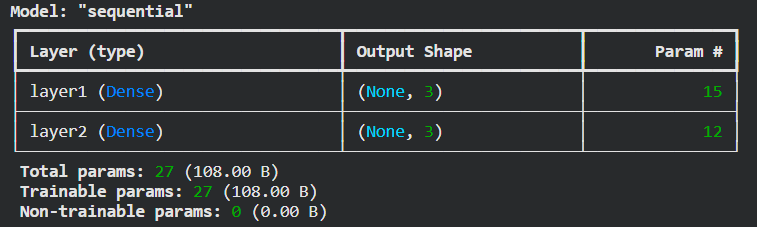

#### Modelo profundo
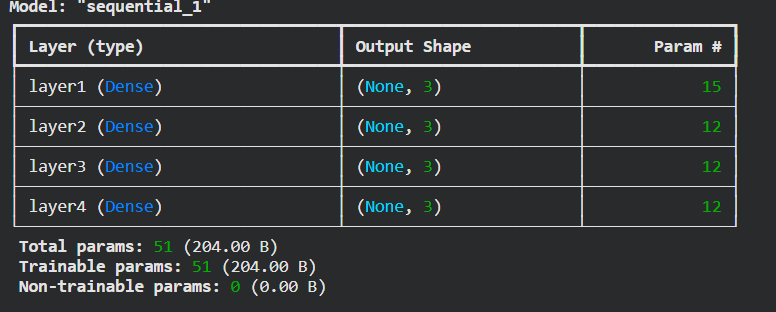

#### Curva original
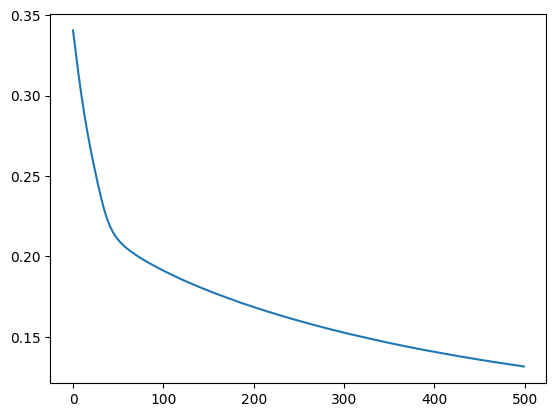

#### Curva profunda
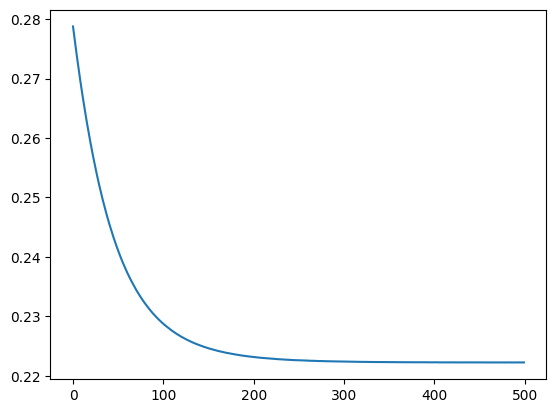

---

## Sección 3: Reporte

Al comparar las dos arquitecturas, lo primero que salta a la vista es que agregar capas no ayudó — al contrario, empeoró el desempeño en ambos casos. En NumPy el error final pasó de 0.097 con la red de 4x3x3 a 0.669 con la red de 4x3x3x3x3, es decir, casi siete veces peor. En Keras el efecto es menos dramático en magnitud (de 0.1317 a 0.2223), pero la señal más clara está en la predicción de ejemplo: mientras que la red original diferenciaba con cierta confianza entre clases (0.67 / 0.28 / 0.20), la red profunda terminó prediciendo prácticamente lo mismo para las tres clases (0.335 / 0.336 / 0.336). Eso no es una red que decidió con matices; es una red que dejó de aprender. Así que la respuesta a la primera pregunta es que sí, el comportamiento es consistente entre ambas implementaciones: agregar profundidad no bajó el error, lo empeoró.

Sobre si las curvas de la notebook 01 y la de Keras se parecen para la misma topología (4x3x3): tienen una forma general similar —ambas decrecientes, ambas tienden a aplanarse— pero no son idénticas, y hay razones de implementación bastante concretas para eso. La versión manual actualiza los pesos ejemplo por ejemplo (150 actualizaciones por época, gradiente descendente estocástico puro), mientras que Keras, al no especificarse `batch_size`, entrena por mini-lotes (se ve en el log "5/5" pasos por época, es decir, lotes de tamaño ~32), lo que da actualizaciones mucho menos frecuentes y más suaves por época. A eso se suma que la inicialización de pesos es distinta: el código manual usa una distribución uniforme en [-0.5, 0.5], mientras que Keras inicializa las capas densas con Glorot/Xavier por defecto. Ambos factores —granularidad de la actualización e inicialización— bastan para explicar por qué las curvas no son calcadas aunque compartan la misma arquitectura y la misma función de error.

Con sigmoides apiladas y error cuadrático medio, sí tiene sentido que una red más profunda no aprenda mejor en un problema como Iris, y de hecho es casi el resultado esperado: la derivada de la sigmoide tiene un máximo de 0.25, así que al retropropagar el error a través de cuatro capas ese factor se multiplica una y otra vez, y el gradiente que finalmente llega a las capas cercanas a la entrada se vuelve minúsculo. Es el clásico problema del gradiente que se desvanece. En la práctica esto se traduce en pesos que casi no se mueven en las primeras capas, y una red que, en el mejor de los casos, aprende muy lento, y en el peor —que es justo lo que se ve en la curva y en la predicción casi uniforme de Keras— se queda atascada cerca de su punto de inicio. Iris es además un problema pequeño y relativamente simple (linealmente casi separable en dos de sus tres clases), así que no necesita —ni se beneficia de— más profundidad; con una sola capa oculta ya hay capacidad de sobra, y las capas extra solo añaden más superficie para que el gradiente se diluya antes de llegar a donde importa.

---

## Sección 4: Evidencia de ejecución en Colab

### Perceptrón Multicapa (NumPy)

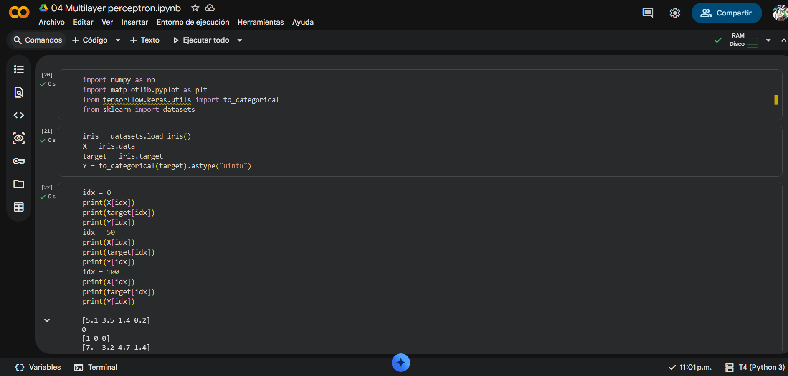

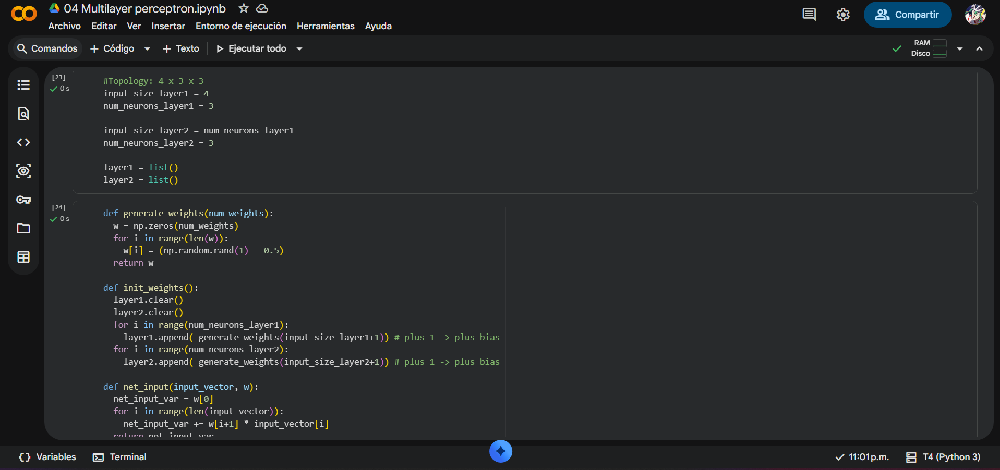

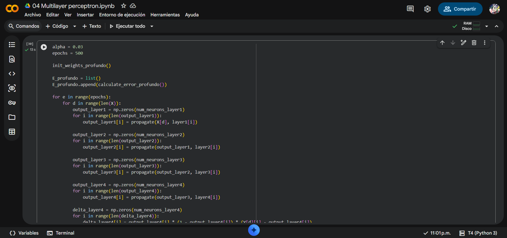

### Perceptrón con Keras

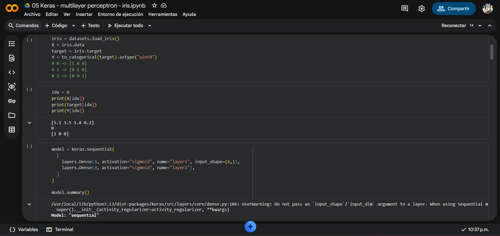

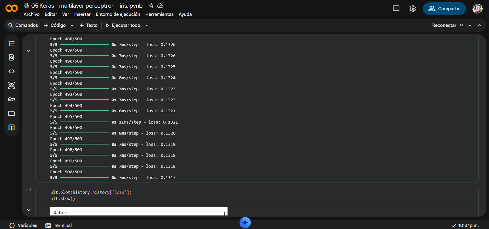

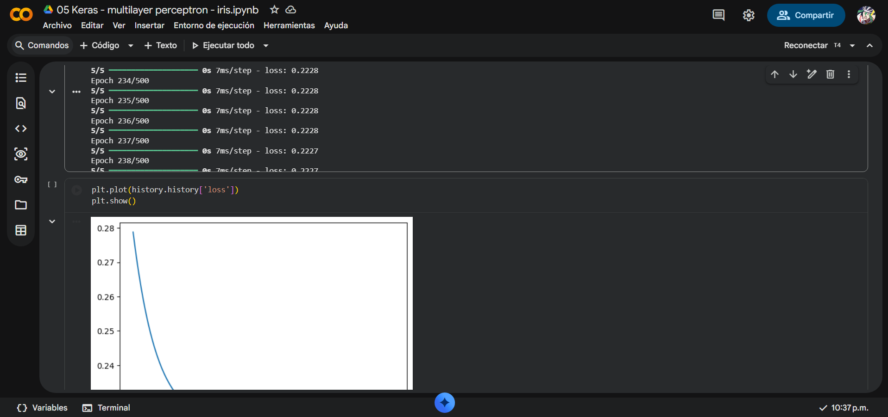
