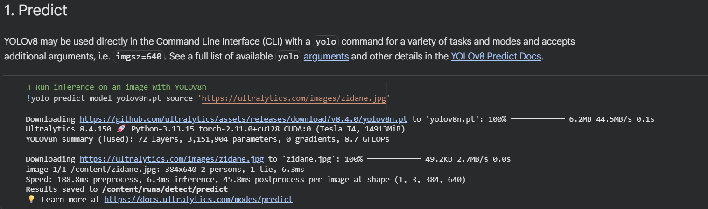
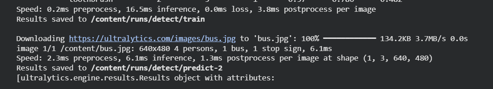
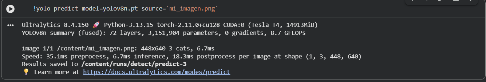

# Ejercicio 1 - 06 Visualización Computacional

**Autor:** Ángel Alberto González Lugo

---

## Sección 1: Link del Colab

[https://colab.research.google.com/drive/1oYr1ifeZLu4fPd8fIYGj-8QZJwtxHd3B#scrollTo=GcWN6UOfWf-Y](https://colab.research.google.com/drive/1oYr1ifeZLu4fPd8fIYGj-8QZJwtxHd3B#scrollTo=GcWN6UOfWf-Y)

---

## Sección 2: Resultados de ejecución

### Zidane (Detección)

### Bus (Predicción)

### Mi Imagen (Predicción propia)

---

## Sección 3: Reporte de resultados

En las fotos de ejemplo de Ultralytics, YOLO se comportó de manera consistente con lo que uno esperaría de un modelo entrenado en COCO: en la foto de Zidane detectó 2 personas y una corbata, y en la del camión identificó 4 personas, el camión y una señal de alto. En mi propia foto, dos gatos sentados en el marco de una ventana mirando hacia afuera, el modelo detectó "3 cats", a pesar de que en realidad solo hay dos gatos en la imagen. Lo más probable es que, al estar los dos cuerpos tan pegados entre sí y con las colas entrelazadas, el modelo haya interpretado una parte del cuerpo de uno de los gatos como un tercer objeto separado; es un caso típico de sobredetección que ocurre cuando dos instancias de la misma clase están muy cerca o se superponen parcialmente.

Curiosamente, lo que no salió etiquetado en mi foto no fue ningún gato, sino todo lo demás que aparece en la imagen: la ventana, el marco blanco, el follaje verde de fondo. Esto no es un fallo del modelo ni un problema de tamaño o recorte, sino una limitación esperada: COCO, el conjunto de datos con el que se entrenó YOLOv8n, tiene 80 clases y ninguna de ellas es "ventana", "marco" o "árbol/planta exterior" (existe "potted plant", pero es una maceta de interior, no vegetación de fondo). El modelo simplemente no tiene una categoría a la cual asignar esos objetos, así que los ignora por completo aunque sean perfectamente visibles para nosotros.

Sobre si la predicción de la celda de línea de comandos (`!yolo predict`) coincide con la que se obtiene llamando directamente a `model(...)` en Python: deberían coincidir, y de hecho así ocurre, porque el comando de CLI no es más que un envoltorio que por debajo llama exactamente al mismo método de inferencia que se ejecuta al invocar el modelo directamente en código. Ambas rutas usan los mismos pesos (`yolov8n.pt`), el mismo umbral de confianza por defecto y el mismo procesamiento de imagen, así que la única diferencia real entre una y otra es la forma en que se invoca, no el resultado que producen.

---

## Sección 4: Notebook en PDF

