# Evidencias del sistema RAG

Sistema RAG sobre la historia de las empresas de videojuegos (Xbox, PlayStation, Nintendo, Sega y Atari).
Todas las capturas se tomaron el 4 de octubre de 2026, con **131 chunks** indexados en ChromaDB.

Las imágenes se cargan desde la carpeta `assets/`, que debe estar junto a este archivo.

## Resumen

| # | Evidencia | Criterio que demuestra | Sección |
|---|---|---|---|
| 1 | Arranque de la API y de la UI | Streamlit (8501) y FastAPI (8000) corren por separado | [1](#1-arranque-del-sistema) |
| 2 | Endpoints en `/docs` | `/health`, `/ingest` y `/query` documentados con OpenAPI | [2](#2-endpoints-documentados-en-docs) |
| 3 | Respuesta en Streamlit | Respuesta en español con citas `[n]` y fragmentos con score | [3](#3-respuesta-con-citas-y-scores-en-streamlit) |
| 4 | La misma pregunta en la API | La UI y la API devuelven lo mismo | [4](#4-la-misma-pregunta-directamente-en-la-api-docs) |
| 5 | Abstención | Sin evidencia, el sistema no inventa | [5](#5-abstención-cuando-no-hay-evidencia) |
| 6 | Persistencia | Reiniciar la API conserva el índice | [6](#6-persistencia-del-índice) |

---

## 1. Arranque del sistema

Primero se levanta la API con uvicorn (puerto 8000) y después la interfaz con Streamlit (puerto 8501), cada una en su propia terminal.

**FastAPI con uvicorn:**

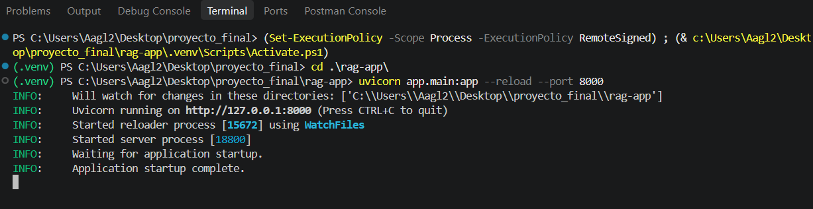

**Streamlit:**

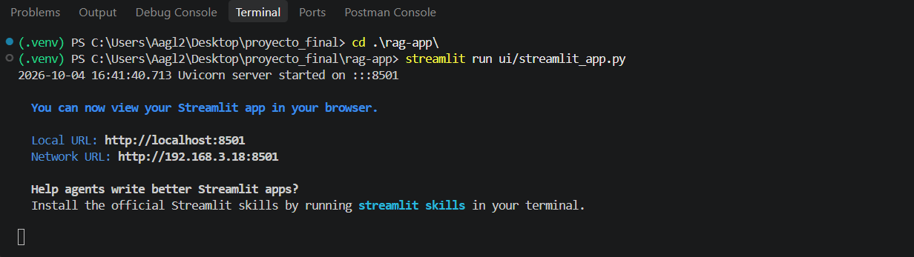

**Interfaz inicial.** La barra lateral muestra "API conectada" y el número de chunks indexados (131), datos que Streamlit obtiene de `GET /health`:

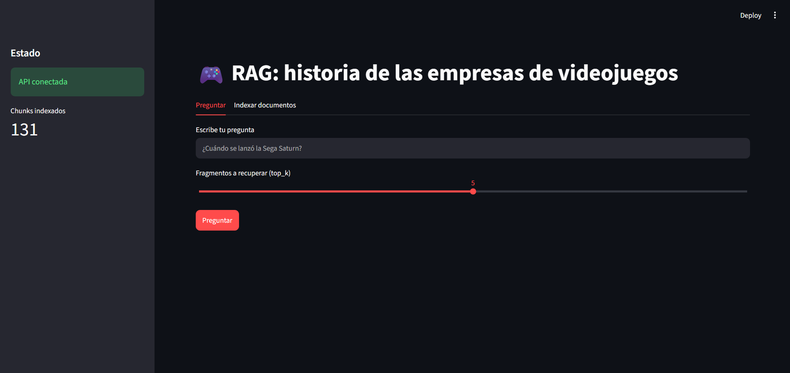

---

## 2. Endpoints documentados en `/docs`

La documentación automática de FastAPI (OpenAPI) lista los tres endpoints pedidos: `GET /health`, `POST /ingest` y `POST /query`.

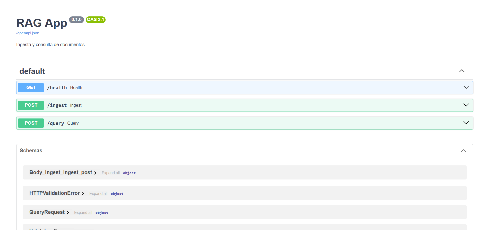

---

## 3. Respuesta con citas y scores en Streamlit

Pregunta: **«¿Cuándo se lanzó la Sega Saturn?»** con `top_k = 5`.

La respuesta está en español y cita los fragmentos con `[n]`. Esos números corresponden a los fragmentos que se muestran debajo.

![Respuesta de Streamlit con citas [1] y [5]](assets/uiAnswer.png)

Al expandir el fragmento `[1]` se ve el texto recuperado, su origen (`sega.md`) y el score de similitud (0.778). El texto contiene las fechas que aparecen en la respuesta.

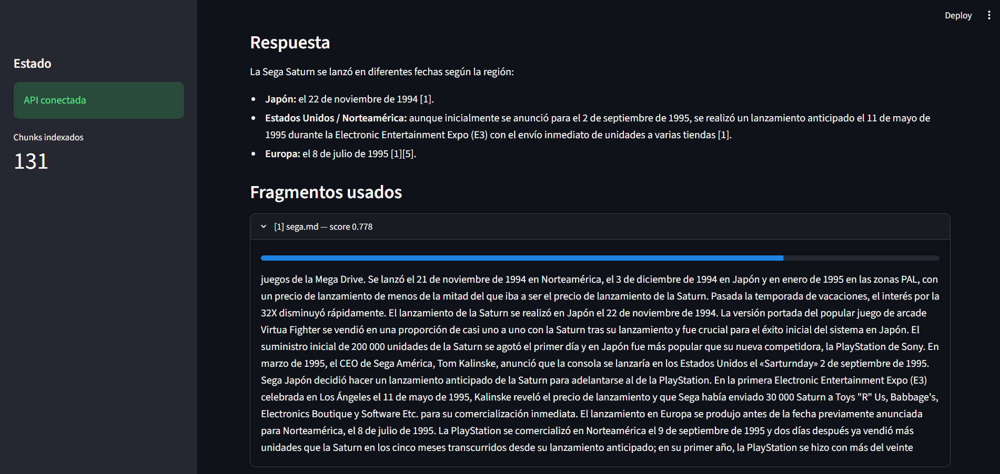

---

## 4. La misma pregunta directamente en la API (`/docs`)

Se envía la misma pregunta a `POST /query`, sin pasar por Streamlit.

**Petición:**

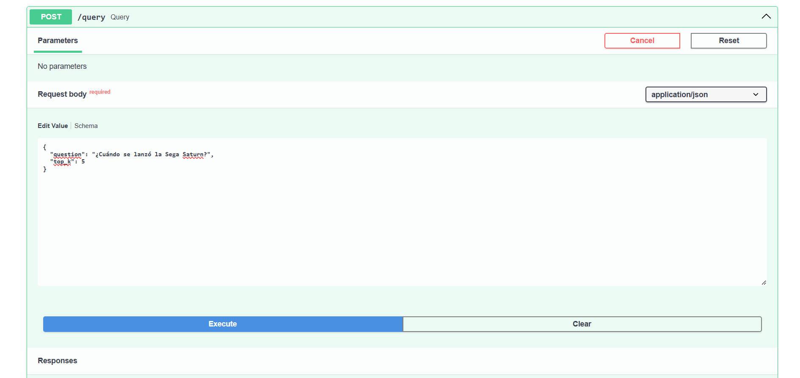

**Respuesta (200 OK).** El JSON incluye `answer`, `citations` (con `n`, `id`, `source`, `text` y `score`) y `abstained`. La cita `[1]` es `sega.md::14`, con el mismo score (0.7777) que mostró la UI:

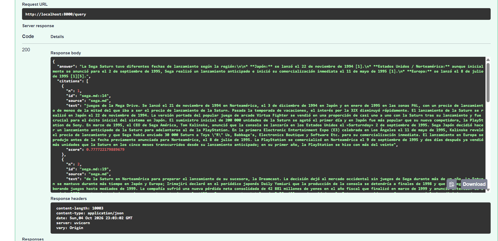

---

## 5. Abstención cuando no hay evidencia

El sistema se abstiene en lugar de inventar. Hay dos casos, y cada uno lo atrapa una capa distinta de la regla de abstención.

**Pregunta sobre el tema, pero sin el dato.** «¿Cuántas consolas vendió Nintendo en 2031?» recupera fragmentos de Nintendo con scores altos (0.711, 0.710, 0.710), casi iguales a los de preguntas válidas, así que el score solo no la distingue. Gemini revisa los fragmentos, ve que ninguno contiene el dato pedido y se abstiene.

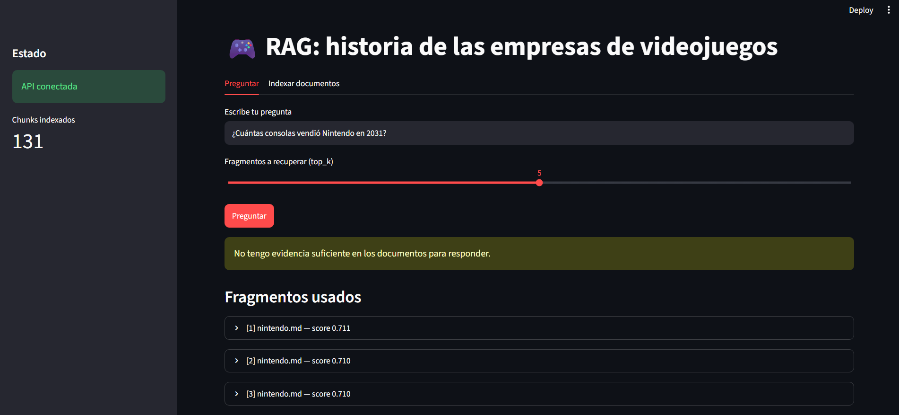

**Pregunta ajena al corpus.** «¿Cuál es la receta del mole poblano?» obtiene scores muy bajos (0.495, 0.490, 0.479), lejos de los 0.72 a 0.78 de las preguntas del dominio. El sistema se abstiene y los fragmentos recuperados siguen visibles en la UI.

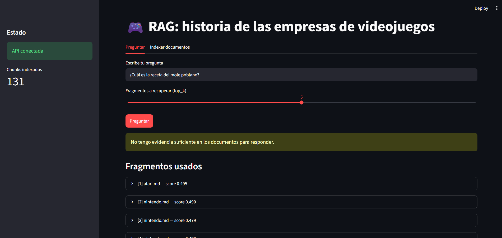

---

## 6. Persistencia del índice

Se comprueba que ChromaDB conserva los datos al reiniciar la API.

**Antes de reiniciar:** `GET /health` informa 131 chunks.

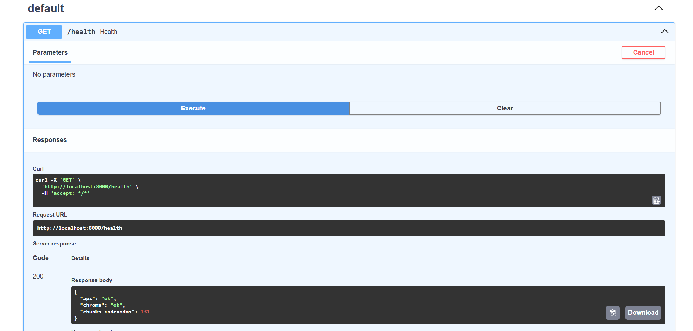

**Reinicio de uvicorn:** se detiene el proceso (`Shutting down`) y se vuelve a levantar.

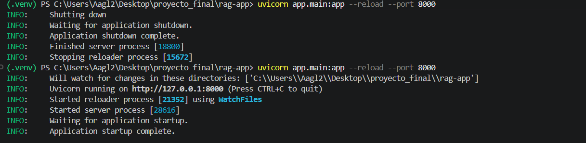

**Después de reiniciar:** `GET /health` sigue informando 131 chunks, por lo que el índice persiste en disco.

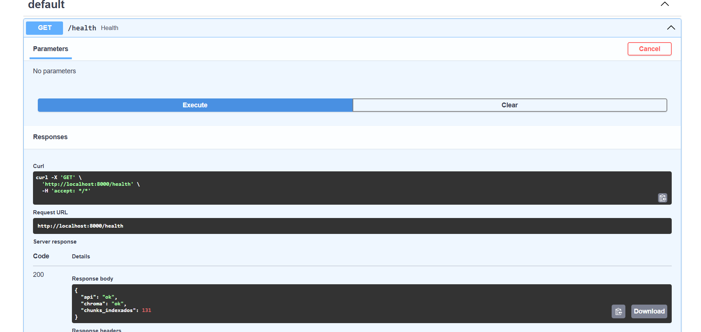
